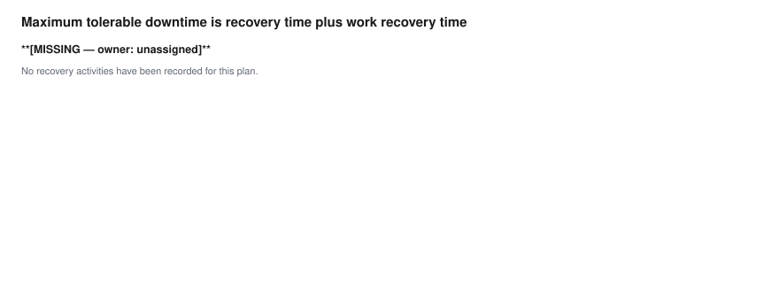

# Maximum tolerable downtime and recovery tiers

What the business can tolerate losing, and for how long.

This document is generated from the answer store. Correct it by correcting the interview, not by editing this file.

## 1.2 Scope

- **The impact level or data classification and where it is recorded**: **[MISSING — owner: governance/risk contact]**
- **The assigned availability impact level, which selects the template this plan is graded against**: **[MISSING — owner: governance/risk contact]**

## 2.1 System Description

- **Whether the production environment is one instance or several, and how they are split**: One production EBS instance, with no multi-org split across regions. The reference plan states this as assumption A7 and records that a multi-instance environment would change the tiering map. It is not marked MATERIAL. *(low confidence; not measured)*

## 3.2.1 Determine Business Processes and Recovery Criticality

**Each business process and what its outage costs at one hour, four hours, a day and a week**

| name | impact_1h | impact_4h | impact_1d | impact_1w |
| --- | --- | --- | --- | --- |
| Order entry and booking | not stated in the reference plan | not stated in the reference plan | not stated in the reference plan | not stated in the reference plan |
| Shipping and fulfilment | not stated in the reference plan | not stated in the reference plan | not stated in the reference plan | not stated in the reference plan |
| AP payment runs | not stated in the reference plan | not stated in the reference plan | not stated in the reference plan | not stated in the reference plan |
| AR cash application | not stated in the reference plan | not stated in the reference plan | not stated in the reference plan | not stated in the reference plan |
| GL and period close | not stated in the reference plan | not stated in the reference plan | not stated in the reference plan | not stated in the reference plan |
| Procurement | not stated in the reference plan | not stated in the reference plan | not stated in the reference plan | not stated in the reference plan |
| Payroll and HR self-service | not stated in the reference plan | not stated in the reference plan | not stated in the reference plan | not stated in the reference plan |
| Reporting and BI | not stated in the reference plan | not stated in the reference plan | not stated in the reference plan | not stated in the reference plan |
| Partner and EDI integrations | not stated in the reference plan | not stated in the reference plan | not stated in the reference plan | not stated in the reference plan |

- **Maximum tolerable downtime for the tier 0 processes**: **[MISSING — owner: business owner]**
- **Recovery point objective for the tier 0 processes**: **[MISSING — owner: business owner]**

## Recorded for this plan

- **The minimum service level that must be available during work recovery**: **[MISSING — owner: business owner]**
- **Whether the tier assignment is signed, and by whom, or who owes it**: **[MISSING — owner: business owner]**

## Supplied by the toolkit's method

Maximum tolerable downtime is recovery time plus work recovery time. The toolkit decomposes it that way so that a recovery which meets its technical target and still misses what the business can tolerate is visible on paper rather than at four in the morning.

**Per tier: maximum tolerable downtime, recovery time, work recovery time, recovery point and the minimum service that counts as trading**

| tier | mtd | rto | wrt | rpo | minimum_service | what_breaks_at_the_mtd |
| --- | --- | --- | --- | --- | --- | --- |
| Tier 0, Platinum | 2 hours or less | 15 minutes or less within the region; 60 minutes or less across regions | about 30 minutes | 0 within the region while the synchronous standby is synchronized and Ashburn is primary; under 30 seconds of transport lag across regions | not stated in the reference plan; its standards alignment records this as gap G1 | not stated in the reference plan; the plan records that its tier figures are not derived from any source |
| Tier 1, Gold | 6 hours or less | 4 hours or less | about 2 hours | 5 minutes or less | not stated in the reference plan; its standards alignment records this as gap G1 | not stated in the reference plan; the plan records that its tier figures are not derived from any source |
| Tier 2, Silver | 24 hours or less | 12 hours or less | about 4 hours | 1 hour or less | not stated in the reference plan; its standards alignment records this as gap G1 | not stated in the reference plan; the plan records that its tier figures are not derived from any source |
| Tier 3, Bronze | 5 days or less | 72 hours or less | about 8 hours | 24 hours or less | not stated in the reference plan; its standards alignment records this as gap G1 | not stated in the reference plan; the plan records that its tier figures are not derived from any source |
 *(low confidence; not measured)*

## 3.2.3 Identify System Resource Recovery Priorities

**Each business process, the tier it is assigned to, and the argument for it**

| process | tier | rationale |
| --- | --- | --- |
| Core financials: GL, AP, AR and FA; Order Management and Inventory transactions; the EBS database itself | 0 | Revenue-recognition and cash-application paths. Data loss is not recoverable by re-keying. |
| Full production application tier: Concurrent Managers, Workflow, Workflow Mailer, iProcurement, self-service HR, integration endpoints | 1 | The business can absorb a few hours; most work re-queues rather than being lost. |
| Visualization, BI and reporting tier, ad-hoc analytics, data extracts, non-critical inbound integrations | 2 | Reporting can wait a day. If the BI tier reads the Active Data Guard standby it is effectively available first. |
| Non-production: Dev, Test, UAT and sandbox clones; archive and long-tail file shares | 3 | Rebuild from backup. Do not pay for warm capacity here. |

## Recorded for this plan

- **How long rebuilding the lost work takes, and who does it**: **[MISSING — owner: business owner]**

## References

Sources for every value above, as recorded when the value was given.

- **Whether the production environment is one instance or several, and how they are split**, recorded by document:oci-itscp/docs/01-architecture.md
- **Each business process and what its outage costs at one hour, four hours, a day and a week**, recorded by document:oci-itscp/checklists/tier-assignment-workshop.md
- **Per tier: maximum tolerable downtime, recovery time, work recovery time, recovery point and the minimum service that counts as trading**, recorded by document:oci-itscp/docs/02-mtd-tiers.md
- **Each business process, the tier it is assigned to, and the argument for it**, recorded by document:oci-itscp/docs/02-mtd-tiers.md

### Unverified statements

Engineering judgements, outstanding gaps and disagreements, labeled as such.

- **The impact level or data classification and where it is recorded**: **[MISSING — owner: governance/risk contact]**
- **The assigned availability impact level, which selects the template this plan is graded against**: **[MISSING — owner: governance/risk contact]**
- **Whether the production environment is one instance or several, and how they are split**:  *(low confidence; not measured)*
- **Maximum tolerable downtime for the tier 0 processes**: **[MISSING — owner: business owner]**
- **Recovery point objective for the tier 0 processes**: **[MISSING — owner: business owner]**
- **The minimum service level that must be available during work recovery**: **[MISSING — owner: business owner]**
- **Whether the tier assignment is signed, and by whom, or who owes it**: **[MISSING — owner: business owner]**
- **Per tier: maximum tolerable downtime, recovery time, work recovery time, recovery point and the minimum service that counts as trading**:  *(low confidence; not measured)*
- **How long rebuilding the lost work takes, and who does it**: **[MISSING — owner: business owner]**
