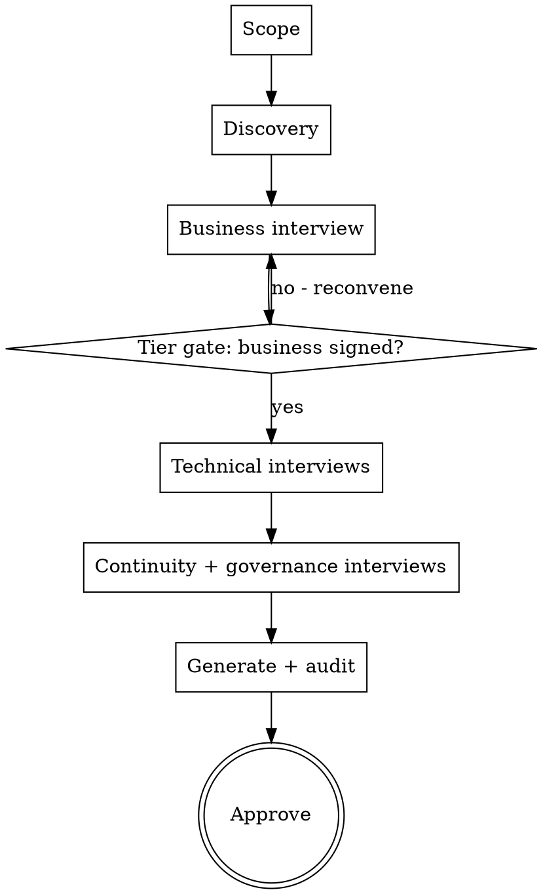

# itscp-build

The orchestrator. It never interviews anybody. It decides **what happens next**, dispatches
the skill that does it, and reports coverage honestly.

**Read first:** `skills/_method/coverage-map.md` (what a complete plan contains),
`skills/_method/answer-store.md` (where answers live). Do not start without both.

---

## The problem this solves

Someone arrives knowing they need a continuity plan and not much else. They do not know what
an ITSCP contains, which of the twenty-odd sections they can answer themselves, who else needs
to be in the room, or what order any of it happens in. Asked "what's your RTO?" on day one
they will produce a number, and it will be wrong.

The ordering is not cosmetic. Real dependencies:

- You cannot tier what you have not inventoried.
- You cannot design recovery before the business has said what must come back first.
- You cannot write escalation thresholds before roles exist to escalate to.
- You cannot claim a target is a commitment before a drill has measured it.

## Sequence



| Phase | Skill | Interviewee | Blocks on |
|---|---|---|---|
| 0. Scope | this skill | the operator | — |
| 1. Discovery | `itscp-discover` | a tenancy, read-only | OCI credentials |
| 2. Business | `itscp-interview-business` | business / process owner | Discovery (so you can name real components) |
| 3. Application | `itscp-interview-application` | application owner, with the lead engineer | Tier gate |
| 4. Infrastructure | `itscp-interview-infrastructure` | infrastructure owner, with the lead engineer | Tier gate |
| 5. Continuity | `itscp-interview-continuity` | DR process owner, with their deputy | Phases 3–4 (roles escalate about real steps) |
| 6. Governance | `itscp-interview-governance` | governance / audit / risk | Phase 5 |
| 7. Generate and audit | this skill, then `itscp-audit` | — | All above |

Phases 3 and 4 are independent of each other and can run in either order, or in parallel with
different people.

---

## Phase 0 — scope

Six questions to the operator, one at a time, before anything else:

1. What is the application suite called, and what does the business call it?
2. Where does it run today — cloud, region, on-premises?
3. Is there an existing plan, in any state? (If yes, read it before interviewing anyone.)
4. Who holds each of the seven roles below, by name, and who deputises for each of them?
5. Is this a real estate, or an exercise? (Exercises skip discovery and use placeholders.)
6. Where should the plan repository live? Default: a new **private** repository.

### The role roster

Fourteen names: seven roles, and a deputy for each. The deputy column is not a courtesy.

| Role | Answers for | Deputy |
|---|---|---|
| Business owner | MTD, tiers, MBCO, the tier signature | Business deputy, able to decide in their absence |
| Application owner | System description, interconnections, validation | Deputy application owner |
| Lead engineer | How the recovery is actually executed; start order; measured figures | Backup lead engineer, or the lead developer |
| Infrastructure owner | Replication design, standby posture, cost floor | Deputy infrastructure owner |
| DR process owner | Declaration authority, call tree, outage assessment | Deputy DR process owner |
| Governance / risk contact | Categorization, review cadence, training, evidence | Deputy governance contact |
| Signing authority | The approval signature | Alternate signatory |

The lead engineer is separate from the application and infrastructure owners on purpose. An
owner is accountable for the thing working; the lead engineer is the person who would be typing
during a recovery, and the two are the same person only in small teams. Where they are the
same person, record that as the answer rather than leaving a row blank, because it is a
concentration worth seeing.

**Never proceed past a missing name in question 4 by substituting yourself.** An unfilled role
is the first finding of the engagement, not an inconvenience — a system with no named business
owner has no one who can sign an MTD, and that is worth saying out loud on day one.

**A role with a holder and no named deputy is a finding of the same class**, not a lesser one.
A plan whose recovery depends on one unreachable person has a single point of failure written
into the plan rather than into the estate. NIST SP 800-34 Rev. 1 §3.4.6 requires a designated
alternate for every team leader, and §4.2.1 requires a clearly identified successor to whoever
holds declaration authority. The reference example carries the gap it warns about: its
authority matrix names a deputy for the declaration and none for a planned switchover or a
failback, the two actions with no "declare and act" path around a missing name.

**Do not invent a deputy either.** An unnamed deputy is recorded MISSING with the role holder
as its owner, and it is carried into `itscp-interview-continuity`, which elicits the ordered
line of succession. The roster and the succession are two views of the same fact and must end
up agreeing. Where they disagree, record a `conflict`, name whose decision it is, and let the
generated plan carry the disagreement openly.

---

## The tier gate

**Do not run the technical interviews until the business has signed the tier assignment.**
The reference repository puts it plainly: doing the workshop late means rebuilding to numbers
you could have known up front. Standby capacity, replication topology and cost all follow from
the tier, and all are expensive to change afterwards.

If the business owner is unavailable for weeks, say so and stop, rather than proceeding on
assumed tiers. Assumed tiers become real architecture within a day and are never revisited.

---

## Reporting coverage

After every phase, report against `coverage-map.md`:

```
Coverage: 34/71 fields (48%)
  ANSWERED 31 | NOT_APPLICABLE 3 | DEFERRED 4 | MISSING 33
  Confidence of ANSWERED: high 9 | medium 14 | low 8

Complete sections:  1.3 Assumptions, 3.2 Notification, App. A, App. H
Blocked sections:   App. K BIA (business owner unavailable until 2026-09-15)
Lowest confidence:  business.wrt.tier0 (low) - no measurement, no mechanism given
Next:               itscp-interview-infrastructure (infrastructure owner, ~90 min)
```

**Three rules for this report.**

1. **Coverage is not quality.** Always print the confidence distribution beside it. A plan at
   90% coverage with 60% low confidence is an organisation that has guessed comprehensively.
2. **Never round up.** 34/71 is 48%, not "about half done". The number is the deliverable.
3. **Never report a section complete because its file exists.** A rendered document full of
   `MISSING` markers is a rendered document, not a complete section.

---

## Generating the repository

The generated repository follows `templates/repo-scaffold/`. Rendering rules:

- A `MISSING` field renders as a visible marker with its owner:
  `**[MISSING — owner: Head of Finance Systems]**`. Never blank, never a plausible default.
- A `low` confidence value renders with its tag: `4 hours *(low confidence; not measured)*`.
- Every generated document carries a `## References` section and an `### Unverified statements`
  section. Judgements the toolkit made go in the latter, attributed as judgements.
- Every `conflict` renders in place, naming both sources and the decision owner.

**The generated plan is a design, not a commitment.** Every duration in it is a target until a
drill measures it. Say this in the README of every repository you generate; the reference
repository says it in three places for good reason.

---

## Red flags

| Thought | Reality |
|---|---|
| "I'll assume standard tiers to unblock the technical work" | Assumed tiers become real architecture within a day. Stop and wait for the business |
| "The operator can answer for the business owner" | They can tell you who the business owner is. They cannot sign an MTD |
| "Coverage is 90%, call it done" | Print the confidence split. Then decide |
| "The file exists, so the section is complete" | Rendered is not complete. Count fields, not files |
| "They only want the technical bits" | Then say plainly which sections of the ITSCP will be absent, and let them choose knowingly |
| "This estate is like the reference repo, I can prefill" | The reference repository is a hypothetical corporation. It is evidence about nothing |
| "The role has a name, the deputy can wait" | The deputy is the plan's own single-point-of-failure control. Missing deputy is a finding, reported like any other |
| "I'll put the operator down as the deputy for now" | That is an invented name in the one place the plan is least able to tolerate one. MISSING, owner: the role holder |
| "The lead engineer and the application owner are the same person, skip a row" | Record it as the answer. A concentration you can see is manageable; one you deleted is not |
